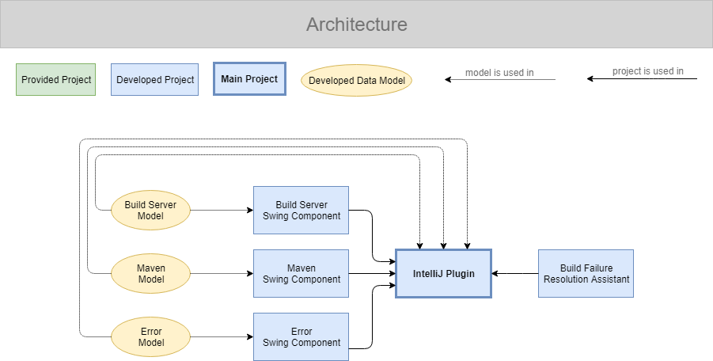

_[Command Line Interface](https://github.com/alexscheitlin/caesar)_ |
**IntelliJ Plugin**

# CAESAR

**Ci Assistant for Efficient (Build Failure) Summarization And Resolution**

_Helps fixing broken builds by downloading and summarizing build logs._

CAESAR connects to a build server and shows all executed builds to the user. By selecting one of the builds the corresponding build log is downloaded, parsed, and summarized. The user then gets a summary of the build's execution like information about it's status (successful or not) or possible errors. Every failed build gets classified (e.g. dependency, compilation, or test issues) and occurred errors are listed with information about their location (file and line/column). If the user decides to fix the build failure, uncommitted changes get saved automatically and the code base causing the build failure is downloaded and checked out. The user may now debug and fix the errors, merge the applied changes to whatever branch he wants, push the changes to the remote repository the build server monitors, reapply the previously saved changes, and continue working where he stopped.

Currently the CAESAR supports projects developed with Git and Maven using TeamCity as a build server. Although the classification of build failures works for numerous types of errors, the error detection and localization is only implemented for basic errors concerning dependency issues, compilation errors, and failing tests.

_To better understand how the IntelliJ Plugin of CAESAR is built, take a look at the sub project table and the architecture image below and explore the different sub projects in the order they are listed in the table below._

_This project is based on the [Command Line Interface](https://github.com/alexscheitlin/caesar) version of CAESAR._

## Sub Projects

This project contains the following sub projects:

| Module | Purpose |
| --- | --- |
| [Build Server Swing Component](build-server-swing-component) | Represents data of a build server model graphically using `javax.swing` components. |
| [Maven Swing Component](maven-swing-component) | Represents data of a maven model graphically using `javax.swing` components. |
| [Error Swing Component](error-swing-component) | Represents data of a error model graphically using `javax.swing` components. |
| [IntelliJ Plugin](intellij-build-failure-resolution-assistant) | Assists in fixing build failures by downloading a build log, parsing and summarizing it, reporting its status and possible errors, stashing open local changes, checking out the failed version, providing hints on where possible errors happened, and let the user fix the error. |

## Architecture

The following visualization shows how the different sub projects interact.

## Authors

- **Alex Scheitlin** - *Initial work* - [alexscheitlin](https://github.com/alexscheitlin)

## License

This project is licensed under the [MIT License](LICENSE).
