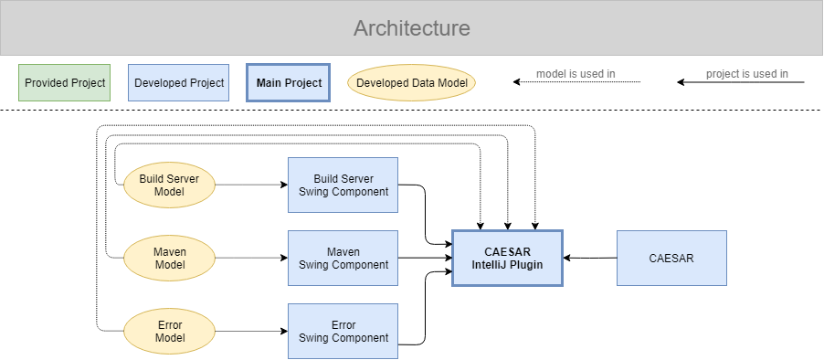

# Build Failure Resolution Assistant IntelliJ Plugin

> _Helps fixing broken builds by downloading and summarizing build logs._

This is the IntelliJ Plugin of the [Build Failure Resolution Assistant](https://github.com/alexscheitlin/build-failure-resolution-assistant).

## Sub Projects

This project contains the following sub projects:

- [Build Sever Swing Component](build-server-swing-component/README.md)
- [Maven Swing Component](maven-swing-component/README.md)
- [Error Swing Component](error-swing-component/README.md)
- [IntelliJ Plugin](intellij-build-failure-resolution-assistant/README.md)

## Architecture

