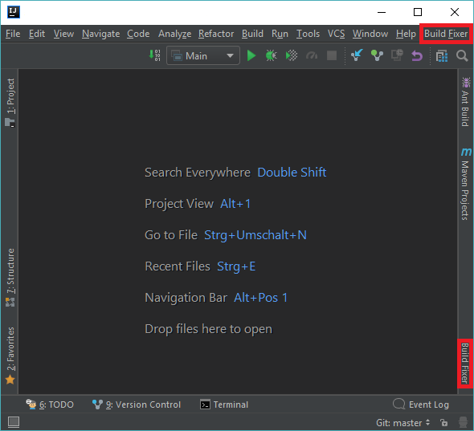
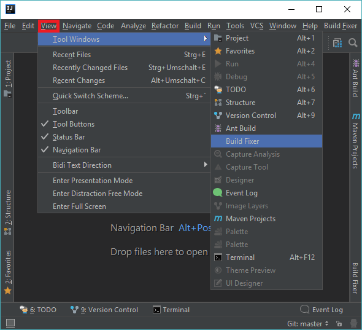
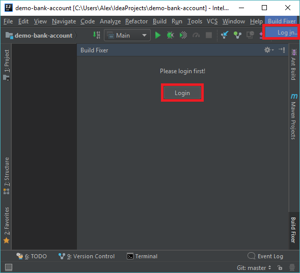
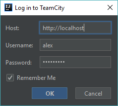
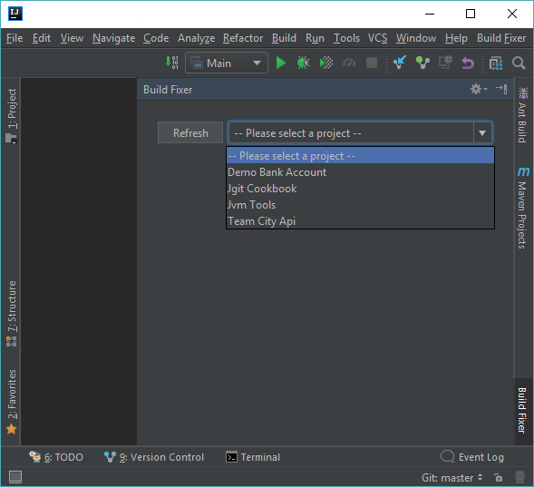
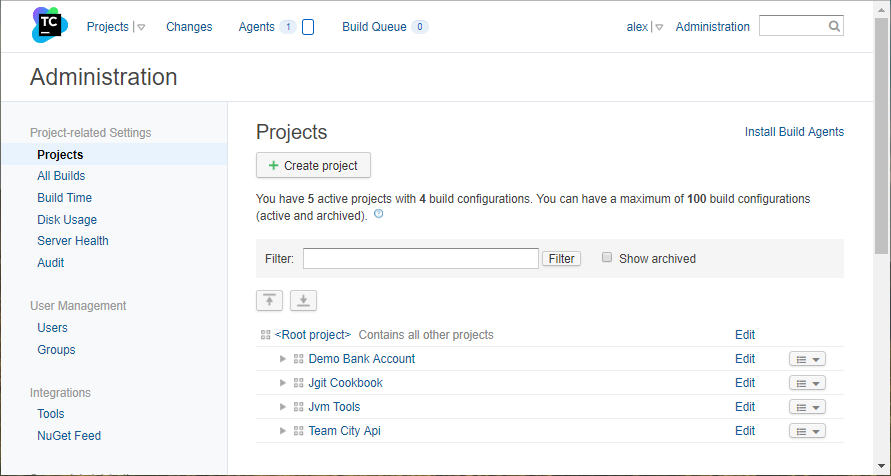
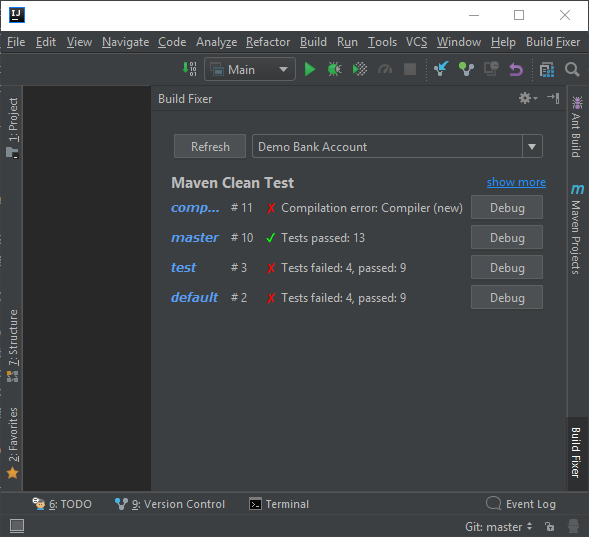

# IntelliJ Build Failure Resolution Assistant

## Workflow

To access the plugin within IntelliJ either use the main menu entry **Build Fixer** on the top right or the tool window bar entry **Build Fixer** on the bottom right.

If the tool window bar on the right is not displayed, open it via the main menu entry **View** -> **Tool Windows** -> **Build Fixer**.

### Login

Either login via the main menu entry **Build Fixer** -> **Login** (shortcut Alt+F -> Alt+I) or use the button on the tool window.

Enter the hostname, username, and password to connect to the build server. Check the _Remember Me_ box so that the provided credentials will be saved and remembered when IntelliJ is closed and opened again. The plugin then uses the saved credentials and logs in automatically.

### Select a Project

After the plugin is successfully connected to the build server, select one of the configured projects.

The provided list of projects the same as on the build server under **Administration** -> **Projects**.

### Select a Build

After selecting a project, select one of the listed builds. The builds are grouped by the build configurations set on the build server for the corresponding project. For each build configuration the builds are listed under the branch of the version control system. This view depends on the **Brach specification** of the VCS root.

### Build Summary

After selecting a build the summary of this build is presented.

### Build Fix

...
